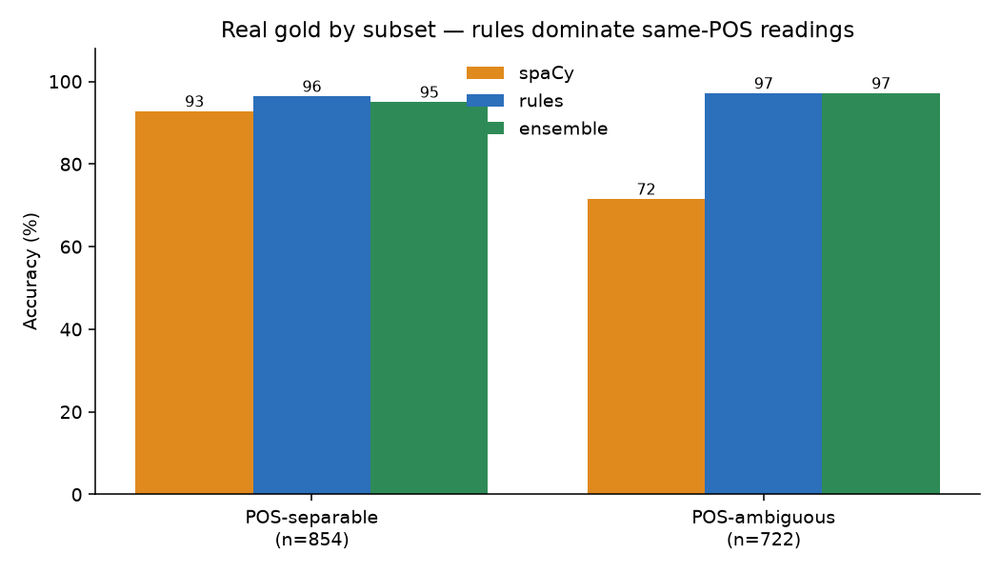

# bifonia

**Pronunciation disambiguation for European-Portuguese heterophonic homographs.** These are words spelled the same way whose pronunciation depends on **meaning**, not just part of speech. bifonia has zero runtime dependencies and uses only the Python standard library.

`sede` means *thirst* (`ˈsedɨ`, closed e) or *headquarters* (`ˈsɛdɨ`, open e). `forma` means *mould* (`ˈfoɾmɐ`) or *shape* (`ˈfɔɾmɐ`). `molho` means *sauce* (`ˈmoʎu`) or *bundle* (`ˈmɔʎu`). A text-to-speech front end that guesses wrong says the wrong word out loud. bifonia picks the right reading, and therefore the right IPA, from context.

```python
from bifonia import tokenize, guess_sense, disambiguate

words = tokenize("Tinha tanta sede que bebi a garrafa toda.")
i = words.index("sede")
guess_sense(words, i)    # 'thirst'
disambiguate(words, i)   # 'ˈsedɨ'   (closed e)

words = tokenize("A sede da empresa fica em Lisboa.")
i = words.index("sede")
disambiguate(words, i)   # 'ˈsɛdɨ'   (open e, same spelling, different word)
```

## Why part-of-speech tagging is not enough

The obvious approach is to tag the part of speech and pick the pronunciation from it. This **does not work when two readings share a POS.** `sede` thirst and seat are both nouns. `forma` mould and shape are both nouns.

A system can look like it solves this problem without solving it. Encyclopedic text (Wikipedia) is **noun-skewed**: one reading dominates and the minority readings barely occur, so a POS tagger that predicts the majority sense scores well on this text. The honest test is a **sense-balanced** set where the minority readings actually appear.

bifonia ships that test: [**`bifonia-pt-homographs-gold`**](https://huggingface.co/datasets/TigreGotico/bifonia-pt-homographs-gold), 2,346 real sentences (OpenSubtitles, Wikipedia, web pages), about 40% of them on POS-ambiguous readings, labelled independently of the engine.

## Accuracy on the balanced real benchmark

| approach | all | POS-ambiguous (same-POS) |
|---|:---:|:---:|
| most-common (majority sense) | 48.2% | 72.0% |
| cue-only (curated wordlists, no POS, no learning) | 53.2% | 87.3% |
| Yarowsky decision list (trained) | 88.6% | 86.5% |

| approach (continued) | all | POS-ambiguous (same-POS) |
|---|:---:|:---:|
| spaCy `pt_core_news_lg` (POS → sense) | 85.8% | 74.0% |
| **bifonia rules (zero-dependency)** | **95.8%** | **97.6%** |


A strong neural POS tagger drops to **74% on the POS-ambiguous half** of the benchmark, since it has no signal to separate two senses that share a part of speech. A zero-dependency, meaning-keyed rule engine holds **97.6%** on the same half. On the POS-*separable* half a tagger does well (about 93%); on the half that needs *meaning*, only meaning works.



A second finding stands on its own: **curated word lists alone reach 87.3%** on the hard cases, before any POS reasoning or learning. Meaning lives in collocations.

## Two engines, one ensemble

| engine | needs a corpus? | how it decides |
|---|---|---|
| **rules** | no | context rules over part-of-speech and meaning cues in `.voc` wordlists |
| **learned** | yes | per-word Naive-Bayes / averaged perceptron over context features |

The rule engine is self-contained and needs no training data, so it fits a low-resource language well. The learned models train from the labelled corpus and serve as a full-roster baseline and a corpus QC engine. `guess_sense` runs a **per-word ensemble**: each word is served by whichever engine wins on held-out behavioural data, so the combined system never scores worse than the rules alone.

A consistent result across this project: **models trained on the corpus do not beat the rules out-of-distribution.** The corpus is rule-labelled, so a model can at best mimic the rules in-distribution and generalizes worse on real text. This holds for Naive-Bayes, the averaged perceptron, and the classic Yarowsky decision list alike. The rules remain the strongest predictor, and an external POS tag can fuse on top:

```python
# hybrid: trust an external tagger only where POS uniquely picks a sense, else rules
guess_sense(words, i, postag="NOUN")
```

On the encyclopedic wild set this hybrid ensemble reaches **95.3%** (rules 90.7%, spaCy 91.6%). The tagger helps on POS-separable words, and the rules carry the rest.

## Install

```bash
pip install bifonia          # zero dependencies, pure standard library
```

## API

```python
from bifonia import (tokenize, is_ambiguous, guess_sense, guess_pos,
                     disambiguate, add_extra_diacritics)

sentence = "Resolveu o problema desta forma simples."
words = tokenize(sentence)
i = words.index("forma")

guess_sense(words, i)                    # 'shape'
disambiguate(words, i)                   # 'ˈfɔɾmɐ'
disambiguate(words, i, sense="mould")    # 'ˈfoɾmɐ'  (override)
add_extra_diacritics(sentence)           # '...desta fórma simples.'  (acute = open vowel)
```

`add_extra_diacritics` rewrites each homograph with a disambiguating diacritic (acute for the open vowel, circumflex for the closed vowel) that a downstream grapheme-to-phoneme stage can read directly.

## Datasets

All datasets are on the Hugging Face Hub, with schema `{word, sense, pos, ipa, sentence}`:

- [**`bifonia-pt-homographs-gold`**](https://huggingface.co/datasets/TigreGotico/bifonia-pt-homographs-gold): 2,346 real, sense-balanced, independently labelled sentences (43 words). This is the honest evaluation set.
- [`bifonia-pt-homographs`](https://huggingface.co/datasets/TigreGotico/bifonia-pt-homographs): the labelled training and synthetic corpus with stratified splits.
- [`bifonia-pt-homographs-wild`](https://huggingface.co/datasets/TigreGotico/bifonia-pt-homographs-wild): the encyclopedic (noun-skewed) wild set.

## Architecture

The design is layered and dependency-free, so a cue behaves the same way in the rules and in the model features:

```
bifonia/text.py      strip / accent-fold / proximity-weighted cue scoring   (shared, stdlib)
bifonia/cues.py      SENSE_CUES + FEATURE_CUES: the cue registry             (single source of truth)
bifonia/scoring.py   context rules + one generic cue resolver
bifonia/features.py  language-agnostic features, incl. CUE:<sense> from the registry
bifonia/locale/<lang>/*.voc   editable context + meaning wordlists
scripts/baselines.py         a Baseline protocol + zero-dep baselines for benchmarking
```

The meaning cues that disambiguate same-spelling readings live in **one declarative registry** (`bifonia/cues.py`), read by both the rule resolver and the model feature extractor. **Adding a homograph is data-only**: drop the `.voc` wordlist(s) and add one registry line, with no new code. Porting to a related language means supplying `.voc` files and, optionally, a corpus, since the algorithm carries no hardcoded Portuguese.

## Coverage

**131 homographs, 265 sense readings.** The disambiguation axis is **vowel quality** (open ɔ/ɛ vs closed o/e). The hard core is the same-POS pairs a tagger cannot touch: `sede`, `corte`, `forma`, `molho`, `bola`, `cor`, `lobo`, `polo`, `tola`. Per-word IPA, senses, and diacritized forms are in [`docs/word_references.md`](docs/word_references.md).

## Related projects

- [`TigreGotico/tugaphone`](https://github.com/TigreGotico/tugaphone): European Portuguese G2P, a consumer of bifonia's disambiguated output.
- [`TigreGotico/silabificador`](https://github.com/TigreGotico/silabificador): European Portuguese syllabification.

## See also

- [`docs/benchmarks.md`](docs/benchmarks.md): full benchmarks and subset plots
- [`docs/methodology.md`](docs/methodology.md): algorithm and features
- [`docs/usage.md`](docs/usage.md): full API reference
- [`scripts/baselines.py`](scripts/baselines.py) · [`scripts/benchmark_ood.py`](scripts/benchmark_ood.py): reproduce the numbers
- [`examples/basic_usage.py`](examples/basic_usage.py): runnable demo

## License

Apache-2.0. See [`LICENSE`](LICENSE).
