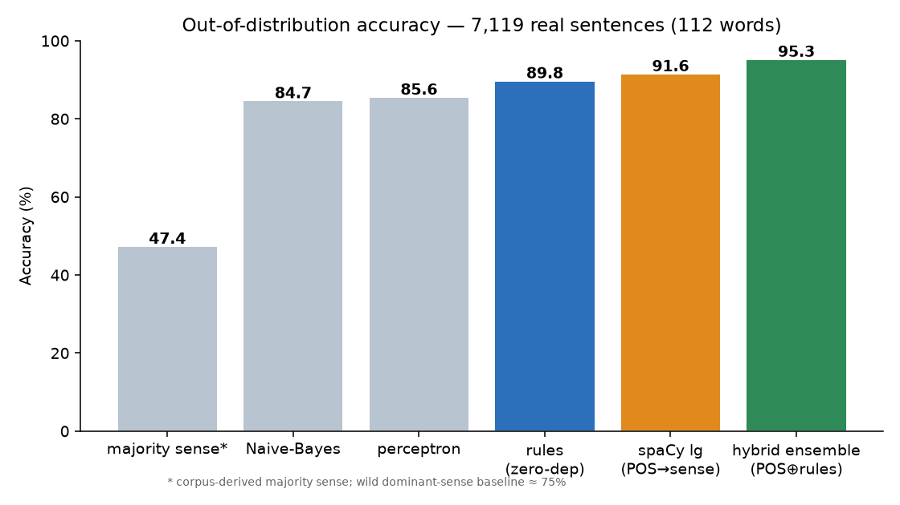
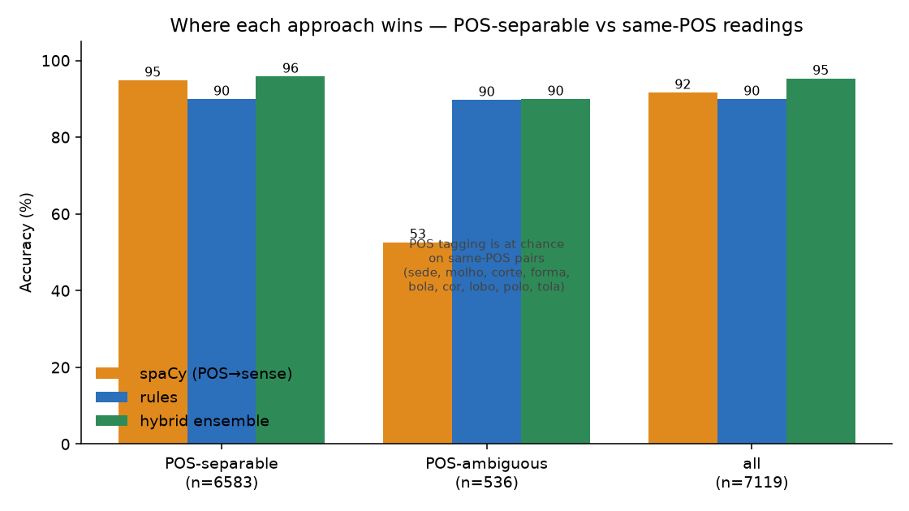
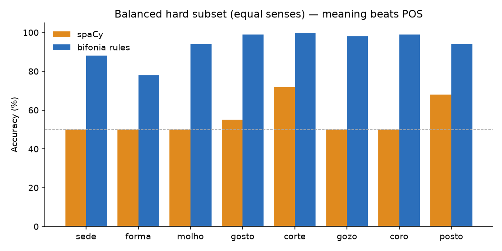
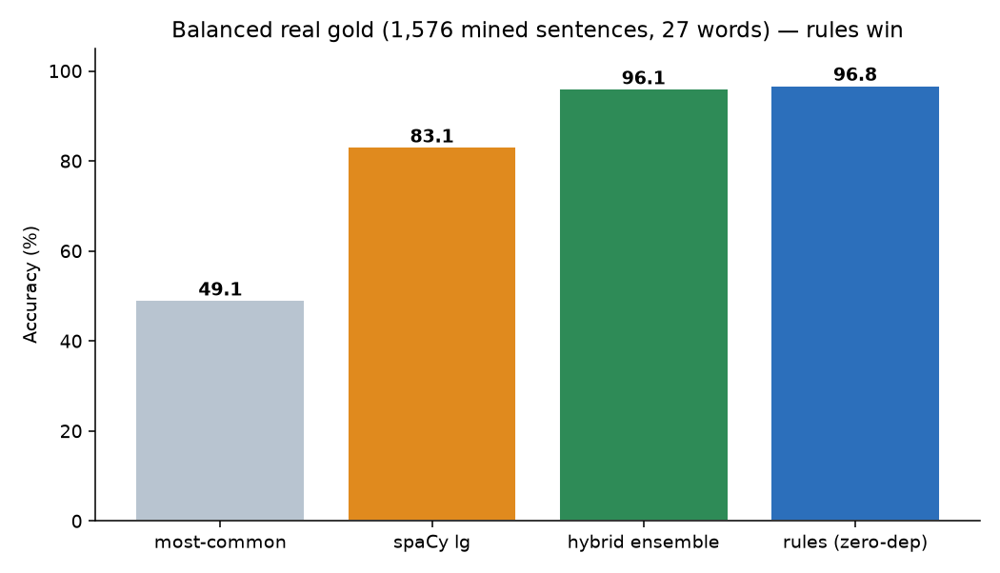
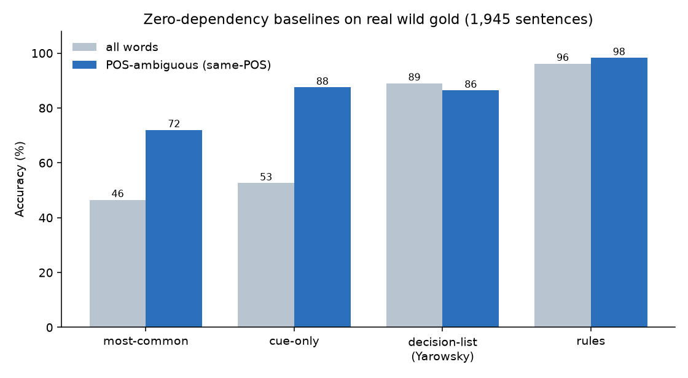

# Benchmarks

## Out-of-distribution (real Wikipedia sentences)

[`TigreGotico/bifonia-pt-homographs-wild`](https://huggingface.co/datasets/TigreGotico/bifonia-pt-homographs-wild)
— **7,119 real sentences across 112 words**.

| approach | OOD accuracy |
|---|---|
| most-common (corpus-derived majority sense) | 46.0% † |
| Naive-Bayes (all roster words) | 85.0% |
| perceptron (all roster words) | 86.5% |
| **rules (zero-dependency)** | **89.9%** |
| spaCy `pt_core_news_lg` (POS → sense) | 91.6% |
| **hybrid ensemble (POS tag ⊕ rules)** | **95.3%** |

### The hybrid ensemble — POS tag for POS-separable, rules for same-POS

The dataset is keyed on **(sense, POS) combos**: each meaning slug carries the
set of parts of speech it can realise (a `corte` reading is `cut` = {NOUN, VERB},
`court` = {NOUN}; `jogo` is `game` = {NOUN}, `play` = {VERB}). A word is
**POS-separable** when every POS maps to exactly one sense — a tagger resolves it
— and **POS-ambiguous** when some POS maps to ≥2 senses (`sede`, `molho`, `corte`,
`forma`, `tola`, `bola`, `cor`, `lobo`, `polo`), where a tagger cannot separate
the senses by construction.

`disambiguate(words, idx, postag=<tag>)` fuses any external POS tagger with the
rules: it trusts the tag only when it uniquely picks a sense, else the rules
decide. Result on the wild set:

| subset | n | spaCy | rules | **ensemble** |
|---|---|---|---|---|
| POS-separable | 6583 | 94.8% | 89.9% | **95.8%** |
| POS-ambiguous | 536 | **52.6%** | 89.7% | **89.9%** |
| **all** | 7119 | 91.6% | 89.9% | **95.3%** |

The ensemble beats both pure approaches: it takes the tagger's strength on
POS-separable readings and the rules' strength where POS is uninformative (a POS
tagger is at chance on the same-POS words). The package stays zero-dependency —
the caller supplies the tag.

### Reading these numbers

- **A strong neural POS-tagger (spaCy) wins here (93%)** because the roster is
  largely **POS-separable** (deverbal noun vs 1sg verb): tagging the homograph's
  POS correctly resolves the reading. The rule engine reaches 89.8% — the
  residual gap is mostly **proper nouns** (place/team names like *Cerro Corá*)
  and minority verb readings.
- bifonia's rule engine is **offline, zero-dependency and deterministic**, and —
  unlike a POS-tagger — it disambiguates **same-POS lexical pairs**
  (`sede` thirst/seat, `corte` cut/court, `forma` mould/shape, `molho`
  sauce/bundle), where a POS-tagger can only fall back to the majority sense.
- **The learned per-word models (Naive-Bayes, perceptron) cover every roster
  word** but trail the rules out-of-distribution (85–86% vs 89.8%). Because the
  corpus labels are produced by the rule engine, a model trained on them can at
  best mimic the rules in-distribution and generalises worse on real sentences.
  The models serve as a full-roster baseline and as the corpus QC engine (see
  [data_quality.md](data_quality.md)); the **rules are the zero-dependency
  predictor**, and the **hybrid ensemble** layers a POS tag on top of them.
- † `most-common` here is derived from the (balanced) bundled corpus, so it picks
  each word's corpus-majority sense — which often isn't the wild-dominant sense,
  hence 46%. The wild set's *own* dominant-sense baseline is ~75% (it is
  noun-skewed; see the skew note below).

## Synthetic (in-distribution)

Rule-engine accuracy on the labelled corpus: **96.5%**.

## Why POS-tagging isn't the whole story

The disambiguation axis is **vowel quality** (open ɔ/ɛ vs closed o/e). POS predicts
it for noun/verb pairs, but the lexical/same-POS pairs need **meaning** cues — the
reason bifonia is meaning-keyed.

## Sense skew and the balanced hard-subset test

The wild OOD set is **sense-skewed** — Wikipedia is encyclopedic (noun-heavy), so
for most words one reading dominates and minority senses barely occur. On the
"POS-no-lift" subset (72 words) **most-common alone scores 98%**, so high spaCy / ensemble numbers there mostly reflect *predicting the dominant sense*, not
disambiguation. spaCy's apparent edge on wild is largely this artifact.

The fair test is **balanced** (equal senses per word), on words a POS-tagger
**cannot** separate (same-POS or POS-unreliable readings):

| approach | balanced hard subset (8 words, n=1280) |
|---|---|
| most-common | 50% |
| spaCy `pt_core_news_lg` (POS→sense) | 59% |
| **bifonia rules** | **94%** |

Per word (rules): `sede` 88, `forma` 78, `molho` 94, `gosto` 99, `corte` 100,
`gozo` 98, `coro` 99, `posto` 94. On the same-POS pairs (`sede`, `molho`, `coro`,
`gozo`) spaCy is pinned at ~50% (chance) — it has no POS signal to use — while the
meaning-keyed rules resolve them. **This is bifonia's core value:
meaning-based disambiguation where part-of-speech is uninformative.**

## Balanced real-gold evaluation

A second real-text set is mined from open sources (OpenSubtitles, news/food/health
sites, Wikipedia) and labelled independently of the rules — every label
individually verified. Unlike the encyclopedic wild set it is **sense-balanced**:
**~68% of its sentences are POS-ambiguous** readings (same-POS pairs and minority
verb senses), so it is a fair test of disambiguation, not dominant-sense prediction.

| approach | balanced real gold (2,233 sentences, 40 words) | POS-ambiguous subset (n=1,512) |
|---|:---:|:---:|
| most-common | 52.6% | 59% |
| cue-only (wordlists, no POS, no learning) | 53.7% | 64% |
| Yarowsky decision list (trained) | 87.0% | 87% |
| spaCy `pt_core_news_lg` (POS→sense) | 90.6% | 89% |
| logistic regression (numpy, +cues) | 92.1% | 94% |
| **rules (zero-dependency)** | **95.2%** | **96%** |
| **hybrid ensemble (POS tag ⊕ rules)** | **96.0%** | **97%** |

Scoring is by **reading** (open/closed IPA), the G2P-relevant target. On the
POS-ambiguous core — the readings a part-of-speech tagger cannot resolve by
construction — the meaning rules hold **96%** and the ensemble **97%**, against
spaCy's **89%**; every learned model (decision list, logistic regression) trails
the rules out-of-distribution, the same corpus-circularity seen elsewhere. The
ensemble edges the bare rules by fusing a POS tag on the POS-separable readings.

## Zero-dependency baselines

All disambiguation baselines here are **pure stdlib** (no numpy), fit on the
synthetic train split and scored on the real wild gold, so they sit on the same
honest footing as the rules. See `scripts/baselines.py` for the shared protocol.

| baseline | all words | POS-ambiguous (same-POS) |
|---|---|---|
| most-common (training majority) | 46.5% | 72.0% |
| cue-only (sense-cue registry, no POS, no learning) | 52.6% | 87.5% |
| decision-list (Yarowsky, one-sense-per-collocation) | 89.0% | 86.4% |
| logistic regression (numpy, same features incl. CUE:) | 92.2% | 93.3% |
| **rules (zero-dependency)** | **96.2%** | **98.3%** |

The numpy logistic regression (the one non-stdlib baseline) is the strongest
*learned* model — the CUE: features lift it well past the decision list, the
Naive-Bayes/perceptron models, and a neural POS-tagger — yet it **still trails the
rules** by ~3-4 points out-of-distribution. So the open question has a clean
answer: with the same cues the rules use, a learned linear model gets close but
does not beat them on real text, because the corpus it learns from is itself
rule-labelled.

Two things stand out. **The sense-cue registry alone reaches 87.5%** on the
same-POS words a POS-tagger cannot separate — the curated cues carry most of the
signal before any POS reasoning or learning is added. And the **trained Yarowsky
decision list trails the rules out-of-distribution** (89.0% vs 96.2%), the same
corpus-circularity effect seen with the Naive-Bayes and perceptron models: a
model fit on rule-labelled synthetic text can at best mimic the rules and
generalises worse on real sentences. The rules remain the strongest predictor; a
numpy-only tier (logistic regression on the same features, TF-IDF
nearest-neighbour) would slot into the same protocol for future comparison.
